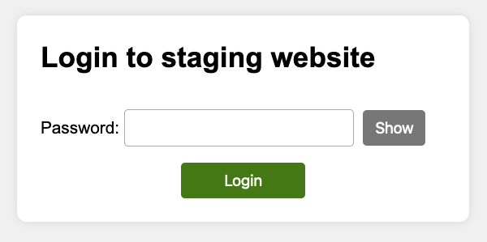

#  Staging site tools

[](https://packagist.org/packages/studio24/staging-site)
[](https://github.com/studio24/staging-site/actions/workflows/php.yml)

A set of simple tools to help manage staging websites, designed for PHP-powered websites.

## What does it do?

When creating or updating a website it's a good idea to publish changes to a staging environment to review before going live.

This package adds the following simple tools to a staging site:

* Secure staging websites behind a simple, accessible login page
* Informs search engine spiders to not index a staging website

It has support for WordPress, Craft CMS, Laravel, Symfony and plain PHP integration.

### Staging site login

The staging site login page is a replacement for basic authentication, which doesn't play well with password managers and is blocked by some client systems.

* It detects the current environment and if it matches staging, it displays the staging site login page
* The staging site login page asks for a single password to access the site
* Once the correct password is entered, a cookie is set to remember the login for a set time period (7 days by default)

[](screenshot.png)

### How long are you logged in for?

By default, the login cookie is set to expire after 7 days. If your IP address or user agent changes, then you are also logged out.

### Logout

You can pass the GET parameter `?staging_site_logout=1` to any URL on your staging website to log the user out.

### Inform search engines not to index a staging site

To effectively stop a staging or development website appearing in search engine results we need to:

- Tell search engines to not list web pages in search results
- But allow search engines to access the web pages so they can read this instruction
 

We can block staging sites from being indexed via the HTTP header X-Robots-Tag:

```
X-Robots-Tag: "noindex, nofollow"
```

This package adds this header to all requests on a staging site.

## Requirements

* PHP 8.1+

## Installation

See the [documentation](docs/README.md) for instructions on how to install this on your website.

## Testing

You can test the staging login via:

```shell
php -S localhost:8000 -t tests/website
```

Access http://localhost:8000 and use the staging password `test123`

You can run unit tests via:

```shell
composer test
```

## Changelog

Please see [CHANGELOG](CHANGELOG.md) for more information on what has changed recently.

## Contributing

Find out more about [how to contribute](CONTRIBUTING.md) and our [Code of Conduct](CODE_OF_CONDUCT.md).

## Security Issues

If you discover a security vulnerability within this package, please follow our [disclosure procedure](SECURITY.md).

## About

This package is developed by [Studio 24](https://www.studio24.net/), a human-centered digital agency who build websites and web apps that work for everyone.

## License

The MIT License (MIT). Please see [License File](LICENSE.md) for more information.
